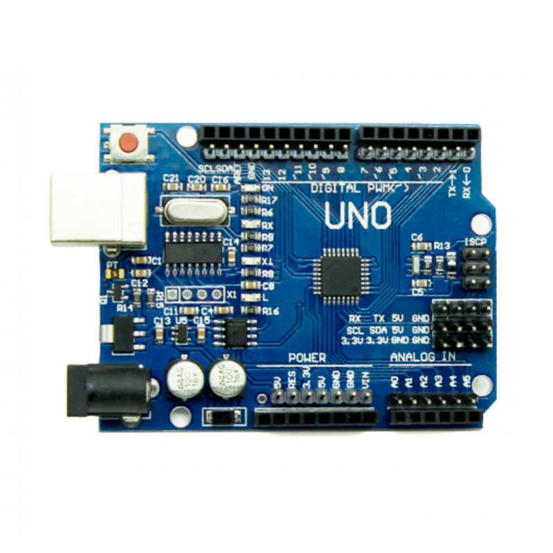
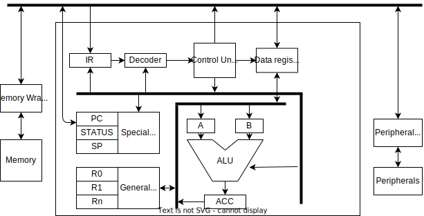

# embedded_basics
This repository will guide you through the basics of programming a microcontroller. It starts from atmega328p based Arduino boards to some advanced ARM controllers
## Overview
Learning embedded system is not just about the programming a software. One must understand the internal working of the hardware which is programmed.
The software needs to be written for varieties of applications that considers many aspects such as speed, power, memory footprint, peripheral support etc.
## Software requirements
### For AVR microcontollers (Atmega328P here)
Cross toolchain: This is required for the cross compilation of source code for the Atmega328P target. It can be downloaded from [here](https://www.microchip.com/en-us/tools-resources/develop/microchip-studio/gcc-compilers)
AVR dude: This is a utility to program the AVR microcontrollers. This can be build from [source](https://github.com/avrdudes/avrdude) or the binaries can be downaloed from the latest stabe release which is metioned in the source repository.
## Board requirements
For the practice purpose different boards can be used. This repository mostly has examples with the following boards.
Arduino R3

This is a low cost atmega328p board which has support for all basic peripherals such as UART, I2C, SPI, ADC, Timer, PWMs etc. making it a perfect candidate for beginers. This board support the programming through Arduino IDE but for the sake of learning the examples will be based on bare metal programming. The tools changes that are required and links are provided in the Software requirement section. The board shown in the image can be obtained from [Pruchase here](https://www.electronicscomp.com/uno-r3-smd-atmega328p-board-compatible-india?gad_source=1&gclid=Cj0KCQjw-5y1BhC-ARIsAAM_oKn8XbTHjkpT_6aKWXE12O16fdge9V9X0N_DTJP0dTU-5WxDjsnMbrsaAn1wEALw_wcB).
This is a low cost make of original arduino board. So, the schematic might not match with Arduino. The schematic will be added in the Schematic section.
## Schematics
## Basics of cpu and its operation
A typical structure of a CPU is shown in the below image. A CPU consit of it's own registers, control unit, arithmetic unit and BUS interconnect.

<a href="http://jgraph.github.io/drawio-github/edit-diagram.html?repo=embedded_basics&path=images/cpu_basic.svg" target="_blank">Edit</a>
Lets understand the functionality of each components in a CPU
### Registers
These are memories that holds data for processing, intructions, decoded informations, status etc. These are placed very tightly inside the CPU so that the latency will be very small. That makes these memories as the fastest. The register data width can vary from device to device but typically it will be power of 2 (because of binary representation) from 8-bit to 64-bit.
Registers are group of flip-flops and gates. Each flip-flop will hold 1 bit of data.

### Control unit
Control unit generate the signals for the operation of the CPU. The signals are indication to execute a memory read, memory write, decode instruction, select the type of arithmetic operation to carry out, updating the status register etc.
### Arithmetic and logic unit
A typical CPU will operation some arithmetic or logical operation in the data. There are dedicated circuitaries present in CPU to do addition, subtraction, multiplication, division, logical operations such as AND, OR, XOR, NOT etc. Each of these units will be selected based on the control signals.
## Memory
## Registers
## Mapping the memory and registers to a software
## Peripherals
## Programmers
## Debuggers
## Examples